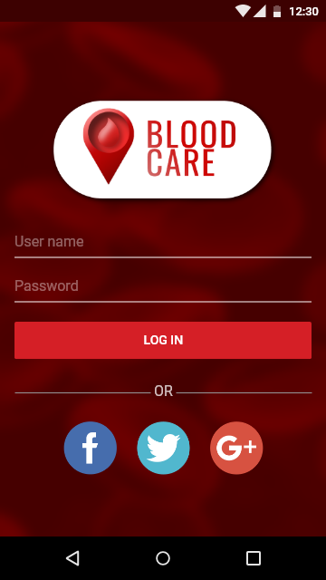
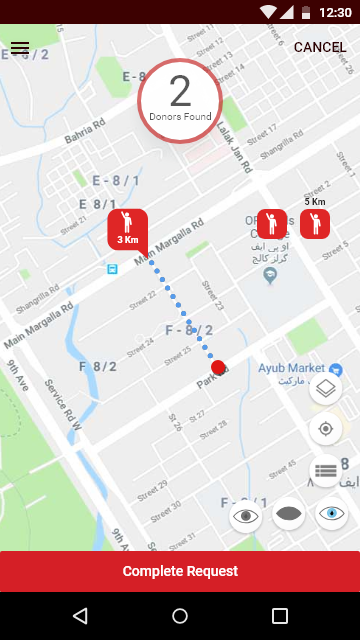
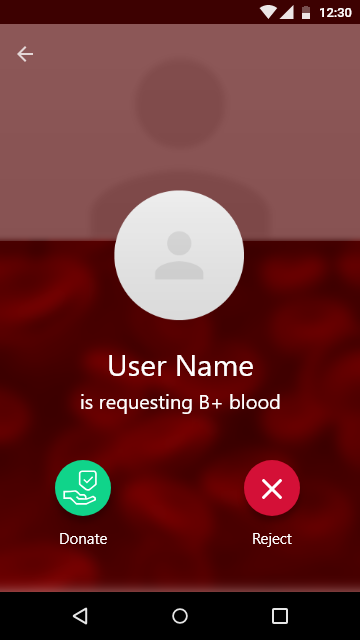
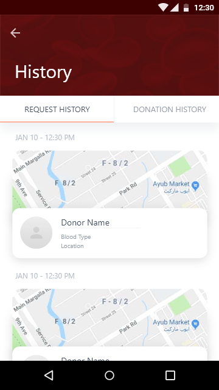
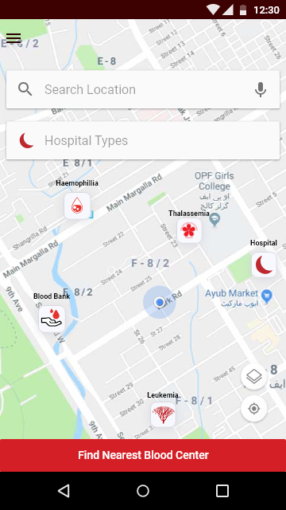

# Blood Care 🩸
(./app/src/main/res/drawable//launch.png) 

Blood Care is an Android app designed to connect users with blood donors, healthcare providers, and emergency services in real-time. It streamlines communication between patients, donors, hospitals, and specialized centers while providing critical features like emergency alerts, health tips, and event management.

---

## Features ✨
1. **Find Blood Donors**: Locate nearby donors of a specific blood group and contact them directly.
2. **Receive Donor Request**: Receive a blood request for your blood group.
3. **Search Healthcare Providers**: Discover hospitals, blood banks, thalassemia, and hemophilia centers nearby.
4. **Blood Donate and Request History**: View all your blood donation and request history.

---

## Screenshots 📱

| Feature | Preview |
|---------|---------|
| **Login Screen** |  |
| **Nearby Doners** |  |
| **Receive Blood Request** |  |
| **Show Blood Donate/Request History** |  |
| **Search Hospitals** |  |
| **View All Hospitals** |  |


---

## User Roles & Functionalities 👥

### **User** 🧑⚕️
**Signup Flow**:
1. Name, Password, Contact, Email
2. Blood Group, Age/DOB, Medical Conditions
3. Location (City/State), Gender, Profile Picture
4. Validation via Contact & Email

**Features**:
- Request blood groups.
- Search doctors, hospitals, and centers.
- View donation/request history.
- Update profile and location.
- Contact donors and view live locations.

---

### **Donor** 🩸
**Signup Flow**: Same as User (with blood group emphasis).

**Features**:
- Accept/reject blood requests.
- View requestor details and share location.
- Track donation history and receive health tips.

---

### **Hospital** 🏥
**Signup Flow**:
1. Name, Password, Contact, Email
2. Location (City/State)
3. Validation via Contact & Email

**Features**:
- Receive blood requests.
- Create blood drive events.
- Send emergency alerts.

---

### **Blood Bank** 🏪
**Signup Flow**: Same as Hospital.

**Features**:
- Manage blood requests and events.
- Communicate with users and update info.

---

### **Thalassemia/Hemophilia Centers** �
**Signup Flow**: Same as Hospital.

**Features**:
- Admit patients and notify emergencies.
- Generate blood drive events.

---

## Installation ⚙️
1. **Clone the Repository**:
   ```bash
   git clone https://github.com/yourusername/blood-care.git
